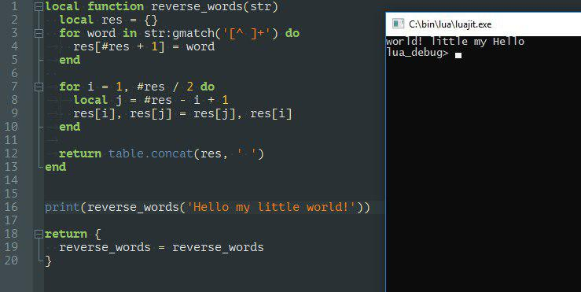

# Translate kata from [codewars](https://www.codewars.com/users/lbvf50mobile)

- Github where tested frameworks stored: https://github.com/Codewars/codewars-runner-cli  
- https://github.com/Codewars/codewars-runner-cli/blob/master/frameworks/lua/codewars.lua 
- https://github.com/Codewars/codewars-runner-cli/blob/master/lib/runners/lua.js [es6 methods for runners](https://developer.mozilla.org/en-US/docs/Web/JavaScript/Reference/Functions/Method_definitions)
- https://github.com/Codewars/codewars-runner-cli/blob/master/examples/lua.yml
- https://github.com/Codewars/codewars-runner-cli/blob/d1c1d8bfb9919ee61d520370484894be27f48739/docker/lua.docker

## Instalation
Reading documentations above secially [here](https://github.com/Codewars/codewars-runner-cli/blob/d1c1d8bfb9919ee61d520370484894be27f48739/docker/lua.docker#L13) I fuond that I need two things: `luarocks` and `busted` from this package. `RUN luarocks install busted`

- http://luarocks.github.io/luarocks/releases/ download `v2.4.2.tar.gz ` but for windows
- and read here [lua instalation for Windows](https://github.com/luarocks/luarocks/wiki/Installation-instructions-for-Windows)
- here is a `busted` [it's a tesing framework](https://luarocks.org/modules/olivine-labs/busted)
- `INSTALL /LV 5.3 /LUA c:\lua`
- I add lua 5.3.4 because lua 5.3.5 dose not works. and add *h files from  the tar file.
- Luarocks 2.4.2 installed, all data wrote to the `LUA_PATH`, `LUA_CPATH`, `Path` windows variables.
- from the `gitbash` I start  luarocks with a `luarocks.bat`
- reading this article https://github.com/luarocks/luarocks/wiki/Using-LuaRocks
- `luarocks.lua install busted` and `Failed installing dependency`
- https://stackoverflow.com/questions/8800361/cl-is-not-recognized-as-an-internal-or-external-command
- https://stackoverflow.com/questions/28913395/luarocks-failed-to-compile-object
- https://stackoverflow.com/questions/31953769/visual-studio-doesnt-have-cl-exe
- `INSTALL /LV 5.3 /LUA c:\lua /MW`
    - Rename `Luarocks` in `Luarocks1`
    - Need to copy headres from `v2.4.2.tar.gz` and rename `src` => `include`
    - Run `mingw-get.exe`
    - set `Lua 5.3.5` now it's works
    - get new `3.0.4` LuaRocks (it fails)
    - need to have `2.4.2`
    - https://github.com/luarocks/luarocks/issues/770
    - going to use `2.4.4`
    - running lua rocks in windows `cli`!
    - `IT WORKS!`
    - **success** `basted.bat test_cases.lua`

### Summary:

`2019.01.30 Wednesday Jan`  
At the `lua.docker` full inforation about lua version. At the codewars Lua works with `LuaRocks` and `Busted` framework. Need to install `LuaRock` on my machine. And then the `codewars.lua` will be clear.   

`2019.01.31 Thursday Jan`  
`LuaRocks 2.4.2` strats by `luarocks.bat` in `gitbash`. I'm using `Lua 5.3.4` becuase `Lua 5.3.5` dose not works at all.

`2019.02.03 Sunday Feb`

`Luarocks` 3.0.4 - fails to install the `busted`. `Luarocks` 2.4.2 works with 5.3.5 lua!
but I cannot install one plugin.
-`Luarocks` 3.0.4 - dose not works a at all
- `Luarocks` 2.4.2 with 5.3.5 Lua cannot install `Busted` because it cannot install dependency `say-1.3.1.rockspec` and it cannot load file. `v.1.3.1.tar.gz`.   
**Success** Using Luarocks `2.4.4`.  
**TODO** write that 3.0.4 dose not works!  
**success** `busted.bat test_cases.lua`

`2019.02.11 Monday Feb`

- work with tick-toward

`2019.06.25 Monday June`

- I want to run, test that dose not run for a long while.
- `cd cd kata-translations/tick-toward/`
- `busted.bat test-cases.lua`
- `cp -r template/ reversed-words/`
- https://www.codewars.com/kata/reversed-words/javascript

@shaman_s_bubom
```
local Obj = {}
function Obj.spam(self)
    print(self)
end

function Obj:spam2()
    print(self)
end

Obj:spam()  -- Obj['spam'](Obj)
Obj:spam2()
Obj.spam(Obj)
```

@djapananda
https://github.com/Yonaba/Moses https://github.com/axmat/lodash.lua

Just use `test_runner.sh` in the `template` to get kata works.

`Wednesday 2019.06.26 June`

- Ruby translation for: https://www.codewars.com/kata/simple-sequence-validator/javascript
- Lua translation for: https://www.codewars.com/kata/reversed-words
- , https://www.lua.org/pil/11.6.html by  @Snusmumriken

`Thursday 2019.06.27 June`

- >The reference solution is available in users' solutions.
describe "Asert Similar" do - typo.
it "Auto true" do - in mosts cases random tests exist to prevent cheating, so the order of expected andwers should be random. ("Auto true" seems a bit weird for a header text, although I don't pay much attention to headers.)

https://www.codewars.com/users/Unnamed 

- fix the https://www.codewars.com/kata/simple-sequence-validator/javascript
- `ruby kata-boom.rb https://www.codewars.com/kata/simple-fun-number-63-shape-area/ruby` traslated
- https://www.codewars.com/kata/playing-with-digits/ruby solved today, want to translate. 

`Monday 2019.07.01 July`

- https://www.codewars.com/kata/playing-with-digits/ruby translated.

`Tuesday 2019.07.02 July`

- https://www.codewars.com/kata/convert-a-string-to-a-number/ruby translated
- https://www.codewars.com/kata/how-good-are-you-really/javascript translated

`Wednesday 2019.07.03 July`

- https://www.codewars.com/kata/sort-odd-and-even-numbers-in-different-order/javascript translated

`Thursday 2019.07.04 July`

- https://www.codewars.com/kata/sort-and-transform/solutions/javascript `refine` in **Ruby**.
- https://www.codewars.com/kata/5d1dd2ba7c046b0023724882 

`Saturday 2019.07.06 July`

- https://www.codewars.com/kata/find-nearest-square-number/javascript translated
- https://www.codewars.com/kata/create-phone-number/ruby solved

`Sunday 2019.07.07 July, Monday 2019.07.08 July`

- https://www.codewars.com/kata/average-array/ruby (`JS, Ruby solved 20190707`)
- **4kyu** https://www.codewars.com/kata/shortest-knight-path/ruby (`JS, Ruby, solved/translated 20190708`)
- **No Ruby translation** https://www.codewars.com/kata/path-finder-number-2-shortest-path/javascript (`JS solved 20190708`)
- **No Ruby translation** https://www.codewars.com/kata/path-finder-number-1-can-you-reach-the-exit/javascript (`JS solved 20190708`)

`Tuesday 2019.07.09 July`

- crate TODO list and implement it's first step.

# TODO

-  Use regex as global variable in templates (**done 2019.07.09 Tuesday**)
-  Add method name in `kata-boom.rb`
-  Auto create template for `Auto tests` at the `test_cases.lua`  at the `alias.sh`


# Lua translations

- https://www.codewars.com/kata/tick-toward
- https://www.codewars.com/kata/which-are-in (`marked 20190201 Friday`) `(["12","34"].join())['23']` <= pass the tests. Need to fix.
- https://www.codewars.com/kata/meeting (`marked 20190202 Satruday 16:09`)
- https://www.codewars.com/kata/51fda2d95d6efda45e00004e (`solve and translate 20190208`)
- https://www.codewars.com/kata/does-my-number-look-big-in-this/ruby (`add 20190211`)
- https://www.codewars.com/kata/5893e0c41a88085c330000a0 (`very simple 20190228 Thursday`, `translated 20190627 Thursday`) **VERY SIMPLE**
- https://www.codewars.com/kata/find-numbers-which-are-divisible-by-given-number/train/javascript (`2019.03.08 Friday`)
- https://www.codewars.com/kata/reversed-words (`translated 20190626 Wednesday`)
- https://www.codewars.com/kata/playing-with-digits/ruby (`solved today want to translate 20190627 Thursday`, `translated in Monday 2019.07.01`)
- https://www.codewars.com/kata/how-good-are-you-really/javascript (`solved 20190701 Monday July, translated 20190702 July, approved 20190704 Thursday`)
- https://www.codewars.com/kata/convert-a-string-to-a-number/ruby (`solved/translated 20190702 July, approved 20190703 Wednesday July`)
- https://www.codewars.com/kata/sort-odd-and-even-numbers-in-different-order/ruby (`solved 20190702 Tuesday July, translated 20190703 Wednesday July`)
- https://www.codewars.com/kata/find-nearest-square-number/ruby (`solved 20190703 Wednesday July, translated 20190706 Saturday`)
- https://www.codewars.com/kata/maximum-length-difference/ruby (`JS, PHP, Crystal solved 20190705 Friday July`)
- https://www.codewars.com/kata/583c5469977933319f000403/solutions/ruby (`JS, Ruby 20190705 Friday July`)
- https://www.codewars.com/kata/create-phone-number/ruby (`JS, Ruby solved 20190706 Satruday`)
- https://www.codewars.com/kata/average-array/ruby (`JS, Ruby solved 20190707`)
- **4kyu** https://www.codewars.com/kata/shortest-knight-path/ruby (`JS, Ruby, solved/translated 20190708`)
- **No Ruby translation**  https://www.codewars.com/kata/path-finder-number-2-shortest-path/javascript (`JS solved 20190708`)
- **No Ruby translation**  https://www.codewars.com/kata/5765870e190b1472ec0022a2 (`JS solved 20190708`)

#  In Codewars
- https://www.codewars.com/kata/51f2b4448cadf20ed0000386 https://www.codewars.com/kumite/5c52f69bbb637958bba592a2/edit 